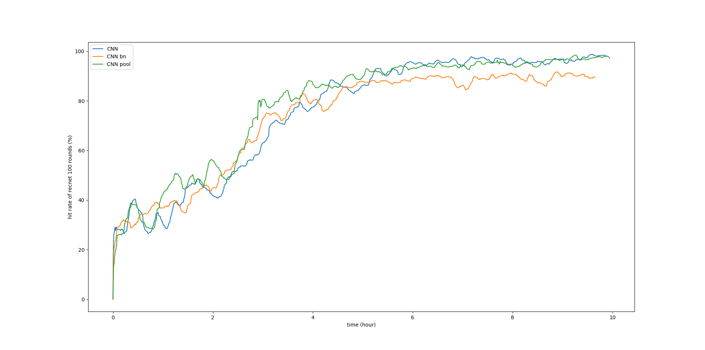

# Pong Pytorch
Beat pong using pytorch and DQN

## Dependencies
- python 3.6  
- pygame  
- pytorch  
- OpenCV  
- numpy  
- tensorboardX  

use `pip` to install what you need :)

## Usage
`python RL.py --net NET`, there are 3 different choices for NET:`CNN`, `CNN_pool` and `CNN_bn`.  

## Result

